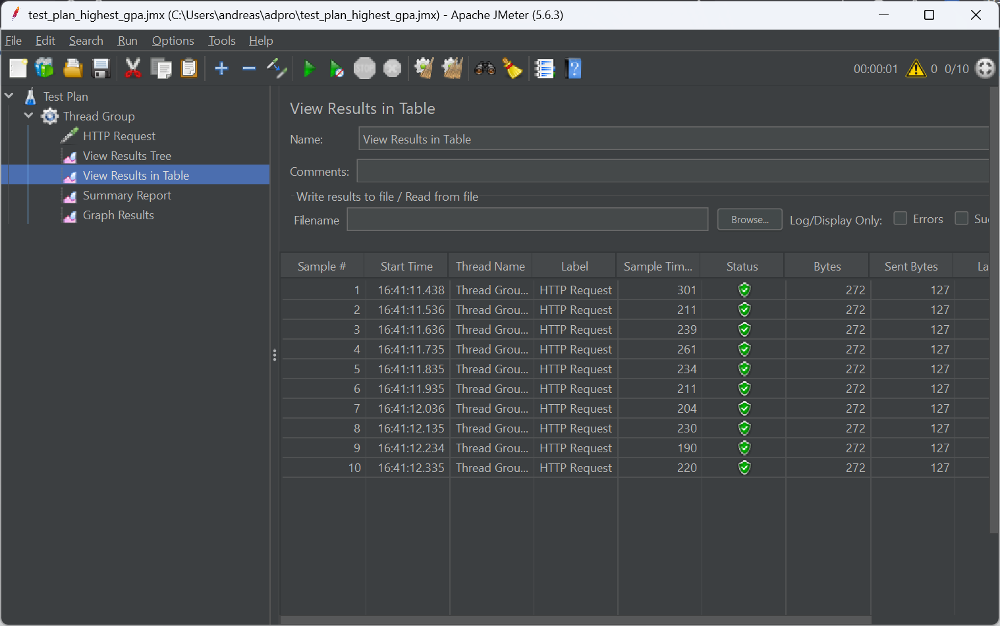

# JMeter GUI Results

## /all-student-name

## /highest-gpa

# JMeter CLI Results

## /all-student-name

## /highest-gpa

# Reflection
1. JMeter is used for performance testing by simulating high loads and measuring response times, while IntelliJ Profiler helps analyze CPU and memory usage at the code level to identify inefficiencies.
2. Profiling pinpoints performance bottlenecks by showing slow methods, excessive memory usage, and inefficient CPU cycles, helping in targeted optimizations.
3. Yes, IntelliJ Profiler effectively identifies performance bottlenecks by providing detailed runtime insights into method execution, memory usage, and thread activity.
4. Challenges:
   - Interpreting large amounts of profiling data. To overcome this, I only focus on high CPU/memory-consuming methods and use filtering tools.
   - Differences in profiling results under real-world load. To overcome this, I combine profiling with real user load tests for accuracy.
5. - Identifies slow methods and memory leaks.
   - Provides real-time performance insights.
   - Helps optimize CPU and memory usage effectively.
6. - Cross-check results by running tests in different environments.
   - Use logs and metrics to correlate profiler data with real-world performance issues.
7. To optimize application performance, I refactor inefficient code, improve algorithms, and reduce memory usage based on profiling insights. To ensure these changes do not break functionality, I run regression tests and validate expected outputs, maintaining application stability while enhancing efficiency.